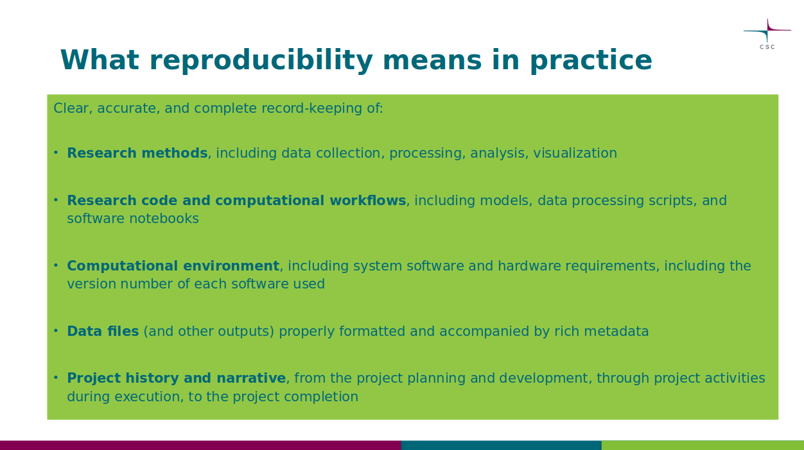
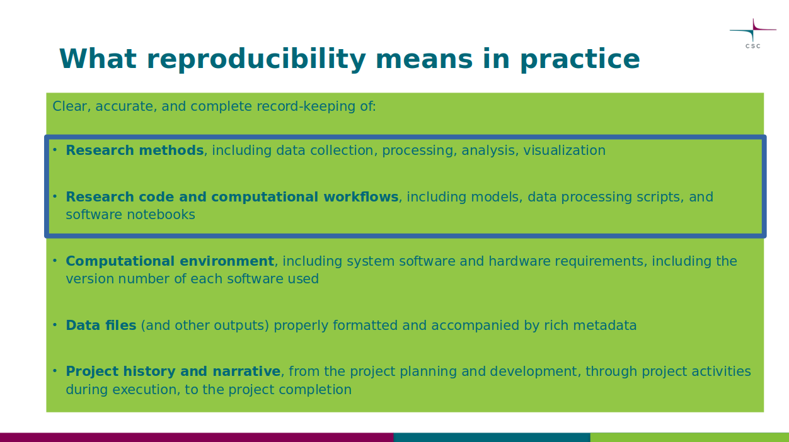
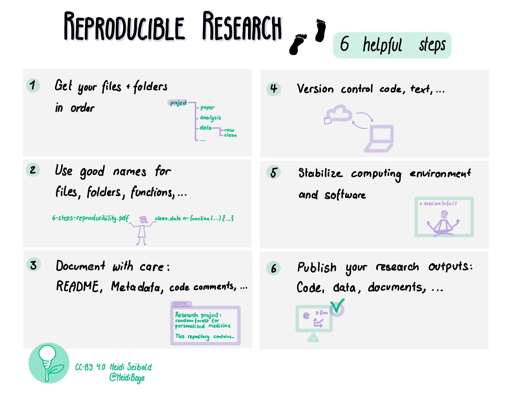
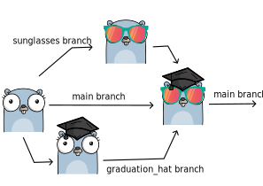
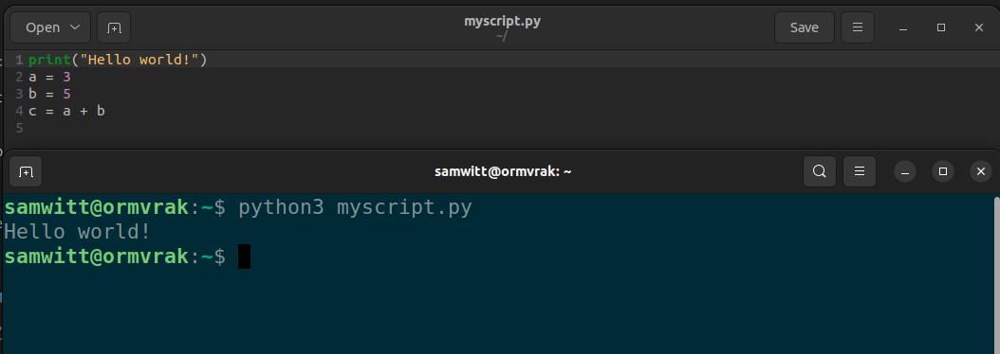
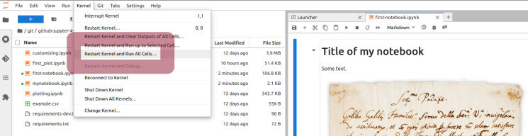
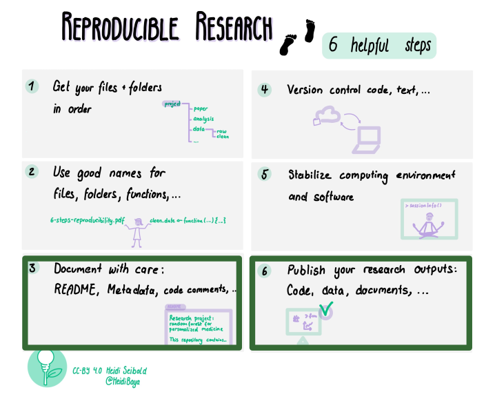
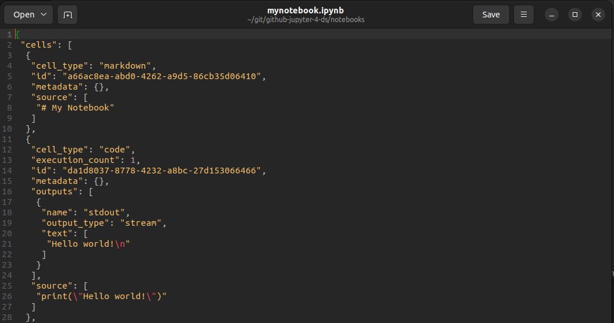
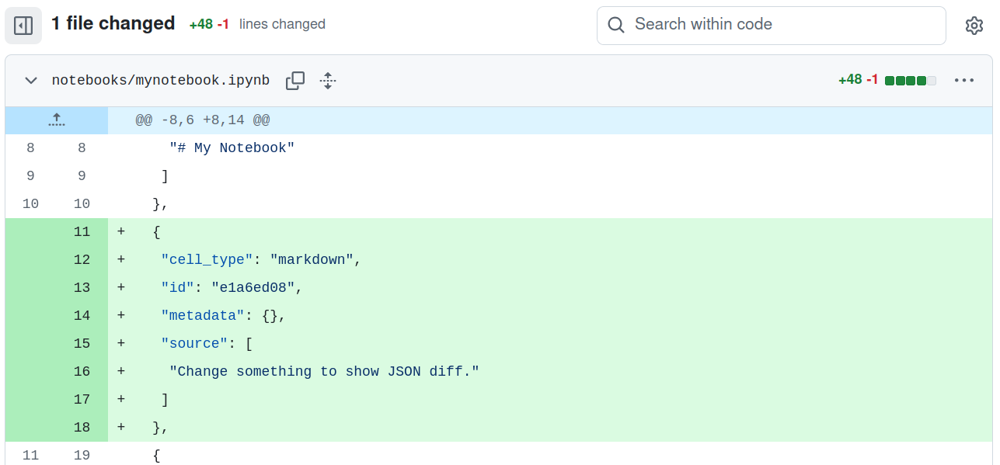

class: center, middle, gray-background


## Enhancing Data Support: Practical Reproducibility

Samantha Wittke

samantha.wittke@csc.fi

### CSC - IT Center for Science


---

# Outline

.left-column50[
Intro and practicalities (10min)

GitHub (45min)

- Version control
- Creating a repository
- Contributing to a repository

Break (10min)

Jupyter (45min)

- Computational notebooks
- Basic features

Where to go from here (10min)
]

.right-column40[

<br>
<br>

.quote[This session will only provide a **glimpse** into the world of GitHub and Jupyter.]

]

???

Connect to part 1 by looking at practical perspective

It is normal that it may be overwhelming. Take it as a starting point and come back when you want to try something new.

---


# Questions

.left-column50[
Please ask at any time
-> Zoom chat or raise hand

.quote[Please be nice and patient with one another. Everyone is on different level and that is OK!]

No breakoutrooms today.
]

.right-column50[

.center[


]

]

???

Might not have time for details, but can also answer later in wrap-up e-mail.


---

# Chatter

.left-column60[

<br>
<br>


1. Type your response into the chat, but WAIT to hit enter
2. Listen for the countdown (three, two, one, CHAT!)
3. Hit enter and watch the responses!

]

.right-column30[


]

???

We will have 3-4 of them during this session. To stay awake. 

---

# Chatter - Let's practice!

.left-column60[

<br>
<br>


One word to describe your morning today?

<br>

.quote[Type your answer in chat, but wait to send]


]

.right-column30[


]

---

# Prerequisites for following along 

<br>

- [GitHub account](https://samumantha.github.io/github-jupyter-4-ds/github-account/)

<br>

- [Access to Noppe](https://samumantha.github.io/github-jupyter-4-ds/noppe/)

<br>

.quote[You can also just watch and ask questions :) But do try it out by yourself later, it is the best way to learn! Recording will be made available.]


---

# Today: Two perspectives

<br>
<br>
<br>

.left-column50[
.center[
## Researcher who codes
]
]

.right-column50[
.center[
## Research support
]
]

???

You may not have use for these tools yourself, but good to know anyway to potentially forward researchers. 

---

class: middle, center




.cite[Josefine Nordlings slide from part 1 of this training]

???

From Josefines slides in part 1. Record keeping enables reproducibility.

---

class:middle



.cite[Josefine Nordlings slide from part 1 of this training]

---

class: middle, center




???

Good overview of reproducible research - from computational perspective. 


---

class: middle, center, inverse

.quote[Code that works (for you) and is shared is not the same as reproducible code!]

???

Previous slide showed this. We look at two tools today that support reproducibility and FAIR research software. 

---

# Version control

<br>

.center[

]

<br>
<br>

- Version control is the practice of **tracking and managing changes over time**.
- You can think of version control like regularly taking a photo ("snapshot") of your work.

---

# GitHub


.center[

]

<br>

-> one place to **find the source** of software, webpages, presentations, books, games, ...

<br>

... and a **place to collaborate** and share

---


.left-column50[

# Git 

<br>

.center[

]

<br>

Tool/format for version control 

Others: Subversion, Mercurial, ...
]

.right-column50[

# GitHub

<br>
<br>

.center[

]
<br>
Hosting service for Git repositories with web interface -> Share and collaborate 

Others: GitLab, Codeberg, ...
]

???

Git: Command line or inbuilt (VSCode etc)

---

class: inverse

# Did you know?

<br>

**In-house GitLab**: Host your own repositories safely within the walls of your organisation.

<br>
<br>

Collaboration in the Nordics: [Nordic GitLab hosted by DeIC](https://coderefinery.org/repository/)

<br>
<br>

Why do we teach GitHub? ➡ Most used, beyond borders

---

# Repositories - a place to store

<br>
<br>

.quote[A repository is the most basic element of GitHub. It's a place where you can **store your code**, your files, and each file's **revision history**. Repositories can be **owned by persons or organisations**, have **multiple collaborators** and can be either **public or private**]

.cite[Adapted from <https://docs.github.com/en/repositories/creating-and-managing-repositories/about-repositories>]

???

Store everything, with history of changes
Ownership
Collborators
Open/closed

---

# Commit - a snapshot

.left-column50[
.center[

]
<br>

.quote[Snapshot of current state of your repository
... like taking a picture with metadata]
]


.right-column40[

<br>
<br>
<br>

- Who?
- What?
- Why? -> Commit message!
- When?

]

???

Commit messages make the history

---

# My own GitHub repository

<br>

## ... continue work on GitHub

1. Work on it, make updates on GitHub, ...
2. Commit when done (per file): take snapshots of units of work (one)

---


# Quick demo (please just watch):

<br>
<br>

.center[

All materials for this session are on GitHub too!

<https://github.com/samumantha/github-jupyter-4-ds>

.quote[Finding a typo in my own repository...]

]

???

Typo is in the README!

---


# Detour: Markdown

.quote[Machine and human readable plain text format. Useful for both GitHub and Jupyter.]

```markdown

# This is a section in Markdown

## This is a subsection          
                               
Nothing special needed for       
a normal paragraph.

**Bold** and *emphasized*.

A list:                           
- this is an item                 
- another item                    


[This is a link to CSC](https://research.csc.fi/)  

```

---

# (Optional) Clone - download

<br>

.center[


<br>

.quote[...get the latest (working) version on your computer]
]

???

Not only the files but also the history.

---

# (Optional) My own GitHub repository

## ... continue work locally

1. Clone: get a copy to my computer
2. Work on it, make updates, ...
3. Add, Commit: take snapshots of units of work (one or many)
4. Push: submit snapshots to GitHub

.quote[Pull: Get latest version from GitHub]

---


class: center, middle


.cite[from <https://raw.githubusercontent.com/hendrixroa/in-case-of-fire-1/master/in_case_of_fire.png>]

---

# Demo: Starting new 

Just watch for now. 

.center[
### <https://github.com/>
.cite[See also: <https://samumantha.github.io/github-jupyter-4-ds/creating-repo-using-web/>]
]


.left-column50[
Create a new repository

- Namespace
- Name
- Description
- README
- LICENSE
- `.gitignore`
]

.right-column50[
Add new file

- Edit
- (Special: license/citation.cff)
- Commit
- `main`

History

Annotate
]

???

New file: type license or citation.cff into filename and check options
Annotate: File -> Preview - Code - Blame


---

## Branches and merge

.center[



]

.cite[Image created using <https://gopherize.me/>
([inspiration](https://twitter.com/jay_gee/status/703360688618536960))]

---

# GitHub pull request

.center[


<br>

.quote[Making a contribution: A request to merge]

]

---

# GitHub issues

.center[


<br>

.quote[Inform, ask and collaborate]

]

---


# GitHub fork


github.com/**myusername**/myrepo 

.right-column60[
➡ github.com/**yourusername**/myrepo
]

<br>
<br>
<br>
<br>


- Propose changes
- Use someone elses work as starting point

<br>

.center[
.quote[Useful when you cannot edit directly]
]

---

# Making a suggestion 

<br>

Full workflow **GitHub**:

1. Suggest idea: issue
2. Discussion -> OK
3. Separate your work: branch / fork
4. Work: work - commit (one or more) 
6. Suggest work: pull request 
7. Accept: merge

➡ You made it to history!

???

This is the workflow for any repo you find on GitHub

---

# (Optional) Making a suggestion 

<br>

Full workflow **local**:

1. Suggest idea: issue
2. Discussion -> OK
3. Get the work: (fork) - clone - pull 
4. Work: work - add - commit (one or more) 
5. Put it on GitHub: push 
6. Suggest work: pull request 
7. Accept: merge

➡ You made it to history!

---

# (Optional) Demo - exploring an existing repo 

Just watch :)

<br>
<br>

- History
- Branches
- Forks
- Issues
- Pull requests

<br>

➡ <https://github.com/the-turing-way/the-turing-way/>

---

# Demo - contribute

You may suggest your own recipes!

<br>

- History
- Issue
- Fork / Branch
- Work
- Pull request

New file vs changing file

<br>

➡ <https://github.com/samumantha/data_support_recipe_book>

???

Commit history: 
- Who?
- What?
- Why? -> Commit message!
- When?

---

# What to track using Git(Hub)?

.left-column50[

.center[

]

- Software
- Scripts
- Documents 
- Manuscripts 
- Configuration files
- Website sources
- Data (better options available!)
]

.right-column50[

.center[

]

- Secrets
- Passwords
- Binaries; files that are difficult to diff
- Files generated from builds
]

???

- Software (this is how it started but Git/GitHub can track a lot more)
- Documents (plain text files much better suitable than Word documents)
- Manuscripts (Git is great for collaborating/sharing LaTeX or Quarto manuscripts)

---

## Is sharing your work on GitHub making it reproducible?

.center[

]


➡ Only in combination with other steps! **Computing environment**: Conda, Pip, Poetry, ...; **Persistent identifier**: Zenodo, ...

.footnote[Barker, M., Chue Hong, N.P., Katz, D.S. et al. Introducing the FAIR Principles for research software. Sci Data 9, 622 (2022). https://doi.org/10.1038/s41597-022-01710-x]'

???

You share your work, that is one of the steps!

---

# Motivation to use Git(Hub)

<br>


.quote[“It broke... hopefully I have a working version somewhere?”]

.quote["Where is the latest version, and which one should I trust?"]

.quote["I am sure it used to work. What changed, when, and why?"]

.quote["When did this problem appear?"]

.quote[“Something looks different - what was updated, and who accepted it?”]

---

class: center, middle

# Summary - GitHub


.quote[Track versions and collaborate and share with others and yourself]


---

class: inverse, center, middle

# Summary - words


Repository

Commit

Fork

Branch

Issue

Pull request

???

repository: the project, including data, history, branches etc. 

commit: a snapshot of the repository at a certain time

fork: your own copy, but still on GitHub

branch: a parallel universe, testing, developing, separation from "working version"

issue: a way to report a bug, suggest a change, ask for a change, discuss an idea

pull request: suggesting a change to be incorporated


---

# Chatter

.left-column50[

<br>
<br>

What usecases for GitHub can you see in your work?

<br>

.quote[Type your answer in chat, but wait to send]

]

.right-column30[

<br>
<br>


]

---

class: center, middle, inverse

# Break

---

class: center, middle


.quote[A tool for people who write code in Python, R or Julia]

---

# Executable notebooks

.center[


]

...

???

RStudio!

---

# Researcher perspective

<br>

Exploration 

.center[.quote[code, notes/explanation, visualization]]

Publish a paper 

Sharing narrative

Share to test and adapt

.center[.quote[executable for others]]

???

Jupyter useful in beginning and end of the research process!

---

# Coding in the terminal

<br>

.center[

]

???

Some people learn coding this way. Functionality check. Temporary. 

---

# Script: A step by step recipe

<br>

.center[


]

???

Mostly: Steps summarized in one file which can be run and rerun with one command or click. 

---

# Notebooks: Interactive exploration

<br>

.center[


]

???

Some people learn coding this way. Interactive and summarized. 

---

# Demo usecase: Protopyping / Exploration

You may follow along: <https://noppe.csc.fi/>

<br>


- Create notebook - naming
- Create cells - code / markdown
- Open an existing notebook (`first_plot.ipynb`)
- Execute cells
- Restart and run all

???

print("Hello world!")

first_plot.ipynb


---


# Good practice

.quote[Kernel > Restart kernel and run all cells]

<br>

.center[



]

---

# Usecase: Teaching

<br>
<br>


- Prefilled
- Exercises as rendered text
- Automatic checks possible

<br>


➡ <https://github.com/csc-training/python-introduction/blob/gh-pages/notebooks/examples/1%20-%20Introduction.ipynb>  ➡ Also available in our Noppe workspace (introduction_to_python_csc.ipynb).

➡ <https://github.com/csc-training/PythonGIS_CSC/blob/master/Raster/Seurasaari_trees.ipynb> ➡ Available in Noppe application "Introduction to geospatial Python".

---

# Usecase: Sharing

<br>
<br>


Tutorial / Walkthrough
➡ Let others explore

<br>

➡ <https://documentation.dataspace.copernicus.eu/APIs/openEO/openeo-community-examples/python/ParcelDelineation/Parcel%20delineation.html>

➡ <https://github.com/eu-cdse/notebook-samples/blob/main/geo/stac_ndvi.ipynb>

???

Show how some tool is used, data is handled, etc. Step by step with images, text and code. 

---

# Sharing


.left-column50[

.center[

]

<br>

GitHub, Websites: **Share to view**

]

.right-column50[

.center[

]

<br>

Binder, Noppe, Google Colab: **Share to execute and change in the cloud**

]

---

class: inverse

# Did you know?

<br>

**Noppe**: CSC service for running **Jupyter or RStudio** in the cloud, free of charge for researchers in Finland

➡ **Readymade applications** (e.g. introduction to Python)

➡ **Teaching** in custom environment, same for all students

➡ **Collaboration**

.quote[Brought to you by ministry of education and culture!]

Support available via `servicedesk@csc.fi` or in our [weekly user support sessions](https://csc.fi/en/training-calendar/csc-research-support-coffee-every-wednesday-at-1400-finnish-time-2-2/).

---

# Jupyter and reproducibility

.center[



.quote[Supports code modularity + documentation and is a good format to share. Needs also info on computing environment.]
]

---

# Under the hood

.center[


.quote[IPYNB ➡ JSON]
]

---

# Tracking changes in ipynb files

.center[


.quote[Version control possible, but limited benefits. Solutions exist, e.g. `nbdime`]
]

---

# Moving away from Jupyter?

<br>

A Jupyter notebook ...

- is super useful in protoyping.
- can even be the endpoint.
- can be used in high performance computing environments.

You may want to switch to scripts when ...

- building a (command line/graphical) tool.
- you need to run it with multiple datasets/parameters.
- efficiency is the goal.

---

# Jupyter ecosystem

<br>
<br>

**Notebook** : Code + markdown cells ➡ `.ipynb`

**Lab** : Interface to view `.ipynb` files, layout, extensions

**Hub** : Jupyter for servers, multiple users

---


class: middle, center, inverse

# Summary

.quote[Jupyter is a helpful tool in the beginning and end of the research process, and can also be used throughout.]

---

# Chatter

.left-column50[

<br>
<br>

How might Jupyter benefit your work in the future?

<br>

.quote[Type your answer in chat, but wait to send]

]

.right-column30[

<br>
<br>


]

---

class: center, middle


.cite[The Turing Way project illustration by Scriberia. Used under a CC-BY 4.0 licence. DOI: <https://zenodo.org/records/13882307>]


---

# Where to go from here ...

Play around with **GitHub**

- Contribute to our recipe book
- Create your own repo
- Try things out with colleagues

Play around with **Jupyter**

- Noppe workspace available for a while
- Check out other Noppe applications
- Install on your own computer (advanced!)

Learn more...

???

Missing from here: Important part of reproducibility is to share info on computing environment
Also documentation, licensing and workflows. 

Pyramid!

---

.center[

]

<br>

Tools and techniques for researchers who code...

3 half days of **Git** (-Hub, VSCode, command line)
+
3 half days of **reproducible research** (computing environments and workflows), **documentation**, **social coding** (sharing and licensing), **modular code development**, **jupyter** (widgets and other tricks) and **automated testing**

- [Materials](https://coderefinery.org/lessons/#lessons-that-we-teach-in-our-tools-workshops)
- [Recordings](https://www.youtube.com/@coderefinery) 
- Next workshop in March '26: Sign up for [newsletter](https://coderefinery.org/about/newsletter/)
- **Bring your own classroom**, contact `support@coderefinery.org`

???

We are actively looking into making CodeRefinery also suitable for data stewards. Wanna help? Contact me!

---

# Chatter

.left-column50[

<br>
<br>

The most exciting thing you learned today?

<br>

.quote[Type your answer in chat, but wait to send]

]

.right-column30[

<br>
<br>


]

---

class: gray-background

# Acknowledgements

Reuse and inspiration was drawn from CodeRefinery and Skills4EOSC.

CodeRefinery lessons: 
- Introduction to and collaborative git
- [Git without the command line](https://coderefinery.github.io/github-without-command-line/)
- Jupyter
- [Programming for Data Stewards](https://coderefinery.github.io/programming4ds/)

Logos are belong to the companies they represent

Icons used are from UXWing

CSC slide by Josefine Nordling from part 1 of this training. 