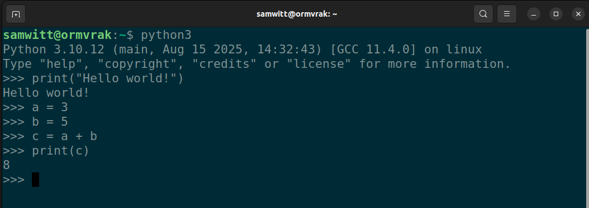

class: center, middle, gray-background

# Enhancing Data Support: Practical Reproducibility

Samantha Wittke

#### CSC - IT Center for Science

---

# Outline

.left-column50[
Intro and practicalities

GitHub

- Version control
- Creating a repository
- Contributing to a repository
- Version control wrap up
]

.right-column50[
Break 

Jupyter 

- Computational notebooks
- Basic features

Where to go from here
]

---

# Questions

.left-column50[
Ask at any time
-> Zoom chat or raise hand
]

.right-column50[

]

---

# Chatter

.left-column60[

1. Type your response into the chat, but WAIT to hit enter
2. Listen for the countdown (three, two, one, CHAT!)
3. Hit enter and watch the responses!

]

.right-column30[

]

---

# Two perspectives 

.left-column50[
Researcher who codes
]

.right-column50[
Research support
]

---

---

---

TODO: Overview: In terms of code, what needs to be shared/documented to enable reproducibility + replicability

---

.quote[Code that works and is shared is not the same as reproducible code]

---

# Version control

- Version control is the practice of **tracking and managing changes over time**.
- You can think of version control like regularly taking a photo ("snapshot") of your work.

---

# GitHub

-> one place to **find the source** of software, webpages, presentations, books, games, ...

> ...under development

and a **place to collaborate** and share

---

# Git and GitHub

.left-column50[
**Git**: Tool/format for version control (others: Subversion, Mercurial)
]

.right-column50[
**GitHub**: Service that provides hosting for Git repositories with a nice web interface -> Share and collaborate (others: GitLab, Codeberg)
]

???

Git: Command line or inbuilt (VSCode etc)

---

# Repositories - a place to store

.quote[A repository is the most basic element of GitHub. It's a place where you can store your code, your files, and each file's revision history. Repositories can have multiple collaborators and can be either public or private.]

???

Personal or Organization namespace

---

# Clone - download

.quote[...get the latest (working) version on your computer]

---

# GitHub - single developer workflow

???

Local development -> snapshot to history (using git)

-> GitHub repository for sharing, storage, safekeeping

--- 

# Commit - a snapshot

.left-column50[

Snapshot of current state of your repository
... like taking a picture with metadata
]

.right-column50[

- Who?
- What?
- Why? -> Commit message!
- When?

]

---

# My own GitHub repository - continue work locally

1. Clone: get a copy to my computer
2. Work on it, make updates, ...
3. Commit: take snapshots of units of work (one or many)
4. Push: submit snapshots to GitHub

Pull: Get latest version from GitHub

---

---

# My own GitHub repository - continue work on GitHub

1. Work on it, make updates, ...
2. Commit: take snapshots of units of work (one)

---

## Branches and merge

Image created using <https://gopherize.me/>
([inspiration](https://twitter.com/jay_gee/status/703360688618536960)).

---

# Pull request - making a contribution

A request to merge.

---

# GitHub issues

Inform, ask and collaborate

---

# GitHub issues 

Not to complain

---

# Fork

.fat[github.com/myusername/arepo -> github.com/yourusername/arepo]

- Propose changes
- Use someone elses work as starting point

.quote[Useful when you cannot directly edit.]

---

# Making a suggestion - Full workflow GitHub

1. Suggest idea: Issue
2. Discussion -> OK
3. Separate your work: branch / fork
4. Work: work - commit (one or more) 
6. Suggest work: Pull request 
7. Accept: merge

-> You made it to history!

---

# Making a suggestion - Full workflow local

1. Suggest idea: Issue
2. Discussion -> OK
3. Get the work: (fork) - clone - pull 
4. Work: work - add - commit (one or more) 
5. Put it on GitHub: push 
6. Suggest work: Pull request 
7. Accept: merge

-> You made it to history!

---

# Demo: Starting new

Create a new repo

- Namespace
- Name
- Description
- README
- LICENSE
- .gitignore

---

# Demo: Add new file

- edit
- commit
- main

History

---

# Summary - words

repository
issue
pull request
clone
commit
fork
branch

---

# What to track using Git(Hub)?

.left-column50[

- Software
- Scripts
- Documents 
- Manuscripts 
- Configuration files
- Website sources
- Data
]

.right-column50[

- Secrets
- Passwords
- Binaries
- Files that are difficult to diff
- Files generated from builds
]

???

- Software (this is how it started but Git/GitHub can track a lot more)
- Documents (plain text files much better suitable than Word documents)
- Manuscripts (Git is great for collaborating/sharing LaTeX or Quarto manuscripts)

---

## Demo - exploring an existing repo

- History
- Branches
- Forks
- Issues
- Pull requests

---

# Demo - contribute

- Issue
- Fork / Branch
- Work
- Pull request

New file vs changing file

---

# Is sharing work on GitHub FAIR?

- Findable?
- Accessible?
- Interoperable?
- Reusable?

=> Support yes, but **GitHub link is not persistent**! -> Zenodo, ...

.footnote[Barker, M., Chue Hong, N.P., Katz, D.S. et al. Introducing the FAIR Principles for research software. Sci Data 9, 622 (2022). https://doi.org/10.1038/s41597-022-01710-x]

---

## Motivation to use Git(Hub)

- “It broke... hopefully I have a working version somewhere?”
- "Where is the latest version, and which one should I trust?"
- "I am sure it used to work. What changed, when, and why?"
- "When did this problem appear?"
- “Something looks different — what was updated, and who did it?”

---

## Summary - GitHub

GitHub: Collaborate and share with others and yourself

---

## Chatter

---

class: center, middle, inverse

## Break

---

## Jupyter

.quote[A tool for people who write code]

---

## Executable notebooks

...

---

## Researcher perspective

- Exploration 
- Publish a paper 
- Sharing narrative
- Executable Notebook to test

???

code, notes/explanation, visualization

---

## Coding in the terminal

---

## Script: summary

---

## Notebooks: interactive

---

## Demo usecase: Protopyping / Exploration

- Create notebook - naming
- Create cells - code / markdown
- Execute cells
- Restart and run all

---

## Demo usecase: Teaching

- Prefilled
- Exercises as rendered text
- Automatic checks 

---

## Demo usecase: Sharing

- Tutorial / Walkthrough
-> Let others explore

---

## Sharing

TODO: GitHub logo, Binder, Noppe, Collab

- share to view,e.g. on GitHub
- share to execute and change

---

## Sharing executable

Noppe
Binder

-> Cloud

---

## Reproducibility

Code -> supports good practices, modularity
Environment (Jupyter is part of that) needed

---

## Under the hood

IPYNB -> JSON

Version control possible, but more limited benefits

---

## Moving away from Jupyter

- Endpoint
- HPC Support

Limits: 
- use as tool from terminal
- multi parameter/data -> efficiency

---

## Summary

Great tool for prototyping or sharing alongside publications

---

# Acknowledgement

CodeRefinery lesson

Logos are companies own

Icons from UXWing